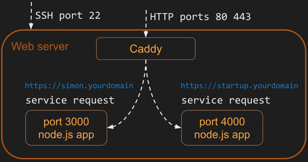

# Intro to webservices

Up to this point, our entirei application is loaded from the web server and runs on the user's browser. It starts when the browser requests the index.html page, which in tern references other HTML, CSSS, JavaScript or image files. All of these files comprise the `frontend` for our application..

The next step in building a full stack web application, is to create our own web service. Our web service will provide the static frontend files along with functions to handle `fetch` requests for things like storing data persistently, providing security, running tasks, executing application logic that you don't want your user to be able to see, and communicating with other users. The functionality provided by your web service represents the `backend` of your application.

Generally functions provided by a web service are called `endpoints`, or sometimes APIs. You acccess the web service from your frotened JavaScript with the fetch function. The backend can also make use of these.

# URL

Looking at the different parts of a URL is a good way to understand what it represents. Here is an example URL that represents the summary of accepted CS 260 BYU students that is accessible using secure HTTP.

```js
https://byu.edu:443/cs/260/student?filter=accepted#summary
```

The URL syntax uses the following convention. Notice the delimiting punctuation between the parts of the URL. Most parts of the URL are optional. The only ones that are required are the scheme, and the domain name.

```yaml
<scheme>://<domain name>:<port>/<path>?<parameters>#<anchor>
```

| Part        | Example                              | Meaning                                                                                                                                                                                                                                                                             |
| ----------- | ------------------------------------ | ----------------------------------------------------------------------------------------------------------------------------------------------------------------------------------------------------------------------------------------------------------------------------------- |
| Scheme      | https                                | The protocol required to ask for the resource. For web applications, this is usually HTTPS. But it could be any internet protocol such as FTP or MAILTO.                                                                                                                            |
| Domain name | byu.edu                              | The domain name that owns the resource represented by the URL.                                                                                                                                                                                                                      |
| Port        | 3000                                 | The port specifies the numbered network port used to connect to the domain server. Lower number ports are reserved for common internet protocols, higher number ports can be used for any purpose. The default port is 80 if the scheme is HTTP, or 443 if the scheme is HTTPS.     |
| Path        | /school/byu/user/8014                | The path to the resource on the domain. The resource does not have to physically be located on the file system with this path. It can be a logical path representing endpoint parameters, a database table, or an object schema.                                                    |
| Parameters  | filter=names&highlight=intro,summary | The parameters represent a list of key value pairs. Usually it provides additional qualifiers on the resource represented by the path. This might be a filter on the returned resource or how to highlight the resource. The parameters are also sometimes called the query string. |
| Anchor      | summary                              | The anchor usually represents a sub-location in the resource. For HTML pages this represents a request for the browser to automatically scroll to the element with an ID that matches the anchor. The anchor is also sometimes called the hash, or fragment ID.                     |

In the past, you could provide a username and password before the domain name, this has since been deprecated, but I may see the convention for URLs that represent connection strings (TODO LEARN MORE ABOUT THIS).

And because URI referes to both URL and URN, and we generally don't talk about URN, we'll just use the term URL.

# Ports

The internet governing body, IANA, defines teh standard usage for different ports.

1. Ports 0 - 1023: represent standard protocols.
1. Ports 1024 - 49151: represent registered ports, that have been assigned to requesting entities..
1. Ports 49152 - 65535: represent dynamic ports that can be used by any application.

Here is a list of common port numbers that you might come across.

| Port | Protocol                                                                                           |
| ---- | -------------------------------------------------------------------------------------------------- |
| 20   | File Transfer Protocol (FTP) for data transfer                                                     |
| 22   | Secure Shell (SSH) for connecting to remote devices                                                |
| 25   | Simple Mail Transfer Protocol (SMTP) for sending email                                             |
| 53   | Domain Name System (DNS) for looking up IP addresses                                               |
| 80   | Hypertext Transfer Protocol (HTTP) for web requests                                                |
| 110  | Post Office Protocol (POP3) for retrieving email                                                   |
| 123  | Network Time Protocol (NTP) for managing time                                                      |
| 161  | Simple Network Management Protocol (SNMP) for managing network devices such as routers or printers |
| 194  | Internet Relay Chat (IRC) for chatting                                                             |
| 443  | HTTP Secure (HTTPS) for secure web requests                                                        |

> As an example of how ports are used we can look at your web server. When you built your web server you externally exposed port 22 so that you could use SSH to open a remote console on the server, port 443 for secure HTTP communication, and port 80 for unsecure HTTP communication.



> Your web service, Caddy, is listening on ports 80 and 443. When Caddy gets a request on port 80, it automatically redirects the request to port 443 so that a secure connection is used. When Caddy gets a request on port 443 it examines the path provided in the HTTP request (as defined by the URL) and if the path matches a static file, it reads the file off disk and returns it. If the HTTP path matches one of the definitions it has for a gateway service, Caddy makes a connection on that service's port (e.g. 3000 or 4000) and passes the request to the service.

> Internally on your web server, you can have as many web services running as you would like. However, you must make sure that each one uses a different port to communicate on. You run your Simon service on port 3000 and therefore **cannot** use port 3000 for your startup service. Instead you use port 4000 for your startup service. It does not matter what high range port you use. It only matters that you are consistent and that they are only used by one service.

# HTTP

The web talks in Hypertext Transfer Protocol (HTTP).

### Request

The HTTP request for the above command would look like the following.

```http
GET /hypertext/WWW/Helping.html HTTP/1.1
Host: info.cern.ch
Accept: text/html
```

An HTTP request has this general syntax.

```yaml
<verb> <url path, parameters, anchor> <version>
[<header key: value>]*
[

  <body>
]
```

The first line of the HTTP request contains the `verb` of the request, followed by the path, parameters, and anchor of the URL, and finally the version of HTTP being used. The following lines are optional headers that are defined by key value pairs. After the headers you have an optional body. The body start is delimited from the headers with two new lines.

In the above example, we are asking to `GET` a resource found at the path `/hypertext/WWW/Helping.html`. The version used by the request is `HTTP/1.1`. This is followed by two headers. The first specifies the requested host (i.e. domain name). The second specifies what type of resources the client will accept. The resource type is always a [MIME type](https://developer.mozilla.org/en-US/docs/Web/HTTP/Basics_of_HTTP/MIME_types) as defined by internet governing body IANA. In this case we are asking for HTML.

### Response

The response to the above request looks like this.

```yaml
HTTP/1.1 200 OK
Date: Tue, 06 Dec 2022 21:54:42 GMT
Server: Apache
Last-Modified: Thu, 29 Oct 1992 11:15:20 GMT
ETag: "5f0-28f29422b8200"
Accept-Ranges: bytes
Content-Length: 1520
Connection: close
Content-Type: text/html

<TITLE>Helping -- /WWW</TITLE>
<NEXTID 7>
<H1>How can I help?</H1>There are lots of ways you can help if you are interested in seeing
the <A NAME=4 HREF=TheProject.html>web</A> grow and be even more useful...
```

An HTTP response has the following syntax.

```yaml
<version> <status code> <status string>
[<header key: value>]*
[

  <body>
]
```

You can see that the response syntax is similar to the request syntax. The major difference is that the first line represents the version and the status of the response.

Understanding the meaning of the common HTTP verbs, status codes, and headers is important for you to understand, as you will use them in developing a web application. Take some time to internalize the following common values.

## Verbs

There are several verbs that describe what the HTTP request is asking for. The list below only describes the most common ones.

| Verb    | Meaning                                                                                                                                                                                                                                                  |
| ------- | -------------------------------------------------------------------------------------------------------------------------------------------------------------------------------------------------------------------------------------------------------- |
| GET     | Get the requested resource. This can represent a request to get a single resource or a resource representing a list of resources.                                                                                                                        |
| POST    | Create a new resource. The body of the request contains the resource. The response should include a unique ID of the newly created resource.                                                                                                             |
| PUT     | Update a resource. Either the URL path, HTTP header, or body must contain the unique ID of the resource being updated. The body of the request should contain the updated resource. The body of the response may contain the resulting updated resource. |
| DELETE  | Delete a resource. Either the URL path or HTTP header must contain the unique ID of the resource to delete.                                                                                                                                              |
| OPTIONS | Get metadata about a resource. Usually only HTTP headers are returned. The resource itself is not returned.                                                                                                                                              |

## Status codes

It is important that you use the standard HTTP status codes in your HTTP responses so that the client of a request can know how to interpret the response. The codes are partitioned into five blocks.

- 1xx - Informational.
- 2xx - Success.
- 3xx - Redirect to some other location, or that the previously cached resource is still valid.
- 4xx - Client errors. The request is invalid.
- 5xx - Server errors. The request cannot be satisfied due to an error on the server.

Within those ranges here are some of the more common codes. See the [MDN documentation](https://developer.mozilla.org/en-US/docs/Web/HTTP/Status) for a full description of status codes.

| Code    | Text                                                                                     | Meaning                                                                                                                           |
| ------- | ---------------------------------------------------------------------------------------- | --------------------------------------------------------------------------------------------------------------------------------- |
| 100     | Continue                                                                                 | The service is working on the request                                                                                             |
| 200     | Success                                                                                  | The requested resource was found and returned as appropriate.                                                                     |
| 201     | Created                                                                                  | The request was successful and a new resource was created.                                                                        |
| 204     | No Content                                                                               | The request was successful but no resource is returned.                                                                           |
| 304     | Not Modified                                                                             | The cached version of the resource is still valid.                                                                                |
| 307     | Permanent redirect                                                                       | The resource is no longer at the requested location. The new location is specified in the response location header.               |
| 308     | Temporary redirect                                                                       | The resource is temporarily located at a different location. The temporary location is specified in the response location header. |
| 400     | Bad request                                                                              | The request was malformed or invalid.                                                                                             |
| 401     | Unauthorized                                                                             | The request did not provide a valid authentication token.                                                                         |
| 403     | Forbidden                                                                                | The provided authentication token is not authorized for the resource.                                                             |
| 404     | Not found                                                                                | An unknown resource was requested.                                                                                                |
| 408     | Request timeout                                                                          | The request takes too long.                                                                                                       |
| 409     | Conflict                                                                                 | The provided resource represents an out of date version of the resource.                                                          |
| ~~418~~ | ~~[I'm a teapot](https://en.wikipedia.org/wiki/Hyper_Text_Coffee_Pot_Control_Protocol)~~ | ~~The service refuses to brew coffee in a teapot.~~                                                                               |
| 429     | Too many requests                                                                        | The client is making too many requests in too short of a time period.                                                             |
| 500     | Internal server error                                                                    | The server failed to properly process the request.                                                                                |
| 503     | Service unavailable                                                                      | The server is temporarily down. The client should try again with an exponential back off.                                         |

HTTP headers specify metadata about a request or response. This includes things like how to handle security, caching, data formats, and cookies. Some common headers that you will use include the following.

| Header                      | Example                              | Meaning                                                                                                                                                                        |
| --------------------------- | ------------------------------------ | ------------------------------------------------------------------------------------------------------------------------------------------------------------------------------ |
| Authorization               | Bearer bGciOiJIUzI1NiIsI             | A token that authorized the user making the request.                                                                                                                           |
| Accept                      | image/\*                             | What content format the client accepts. This may include wildcards.                                                                                                            |
| Content-Type                | text/html; charset=utf-8             | The format of the response content. These are described using standard [MIME](https://developer.mozilla.org/en-US/docs/Web/HTTP/Basics_of_HTTP/MIME_types/Common_types) types. |
| Cookie                      | SessionID=39s8cgj34; csrftoken=9dck2 | Key value pairs that are generated by the server and stored on the client.                                                                                                     |
| Host                        | info.cern.ch                         | The domain name of the server. This is required in all requests.                                                                                                               |
| Origin                      | cs260.click                          | Identifies the origin that caused the request. A host may only allow requests from specific origins.                                                                           |
| Access-Control-Allow-Origin | https://cs260.click                  | Server response of what origins can make a request. This may include a wildcard.                                                                                               |
| Content-Length              | 368                                  | The number of bytes contained in the response.                                                                                                                                 |
| Cache-Control               | public, max-age=604800               | Tells the client how it can cache the response.                                                                                                                                |
| User-Agent                  | Mozilla/5.0 (Macintosh)              | The client application making the request.                                                                                                                                     |

## Body

The format of the body of an HTTP request or response is defined by the `Content-Type` header. For example, it may be HTML text (text/html), a binary image format (image/png), JSON (application/json), or JavaScript (text/javascript). A client may specify what formats it accepts using the `accept` header.

## Cookies

📖 **Deeper dive reading**: [MDN Using HTTP cookies](https://developer.mozilla.org/en-US/docs/Web/HTTP/Cookies)

HTTP itself is stateless. This means that one HTTP request does not know anything about a previous or future request. However, that does not mean that a server or client cannot track state across requests. One common method for tracking state is the `cookie`. Cookies are generated by a server and passed to the client as an HTTP header.

```http
HTTP/2 200
Set-Cookie: myAppCookie=tasty; SameSite=Strict; Secure; HttpOnly
```

The client then caches the cookie and returns it as an HTTP header back to the server on subsequent requests.

```http
HTTP/2 200
Cookie: myAppCookie=tasty
```

This allows the server to remember things like the language preference of the user, or the user's authentication credentials. A server can also use cookies to track, and share, everything that a user does. However, there is nothing inherently evil about cookies; the problem comes from web applications that use them as a means to violate a user's privacy or inappropriately monetize their data.

## HTTP Versions

HTTP continually evolves in order to increase performance and support new types of applications. You can read about the evolution of HTTP on [MDN](https://developer.mozilla.org/en-US/docs/Web/HTTP/Basics_of_HTTP/Evolution_of_HTTP).

| Year | Version | Features                                        |
| ---- | ------- | ----------------------------------------------- |
| 1990 | HTTP0.9 | one line, no versions, only get                 |
| 1996 | HTTP1   | get/post, header, status codes, content-type    |
| 1997 | HTTP1.1 | put/patch/delete/options, persistent connection |
| 2015 | HTTP2   | multiplex, server push, binary representation   |
| 2022 | HTTP3   | QUIC for transport protocol, always encrypted   |

# SOP and CORS

> To combat the problem with hackers mascarading as other websites, the `Same Origin Policy (SOP)` was created.

TODO: ADD MORE NOTES ON THIS

# Fetch

TODO: ADD NOTES ON THIS

[Fetch Codepen Fork](https://codepen.io/zinga331/pen/MWLbORz)

# Service Design

TODO: ADD NOTES ON THIS

# Node.js

⚠ Note that when you start installing package dependencies, NPM will create an additional file named `package-lock.json` and a directory named `node_modules` in your project directory. The `node_modules` directory contains the actual JavaScript files for the package and all of its dependent packages. As you install several packages this directory will start to get very large. You do **not** want to check this directory into your source control system since it can be very large and can be rebuilt using the information contained in the `package.json` and `package-lock.json` files. So make sure you include `node_modules` in your `.gitignore` file.

When you clone your source code from GitHub to a new location, the first thing you should do is run `npm install` in the project directory. This will cause NPM to download all of the previously installed packages and recreate the `node_modules` directory.

The `package-lock.json` file tracks the version of the package that you installed. That way if rebuild your `node_modules` directory you will have the version of the package you initially installed and not the latest available version, which might not be compatible with your code.

With NPM and the joke package installed, you can now use the joke package in a JavaScript file by referencing the package name as a parameter to the `require` function. This is then followed by a call to the joke object's `getRandomDadJoke` function to actually generate a joke. Create a file named `index.js` and paste the following into it.

**index.js**

```js
const giveMeAJoke = require("give-me-a-joke");
giveMeAJoke.getRandomDadJoke((joke) => {
  console.log(joke);
});
```

If you run this code using `node.js` you should get a result similar to the following.

```sh
➜  node index.js
What do you call a fish with no eyes? A fsh.
```

This may seem like a lot of work but after you do it a few times it will begin to feel natural. Just remember the main steps.

1. Create your project directory
1. Initialize it for use with NPM by running `npm init -y`
1. Make sure `.gitignore` file contains `node_modules`
1. Install any desired packages with `npm install <package name here>`
1. Add `require('<package name here>')` to your application's JavaScript
1. Use the code the package provides in your JavaScript
1. Run your code with `node index.js`
