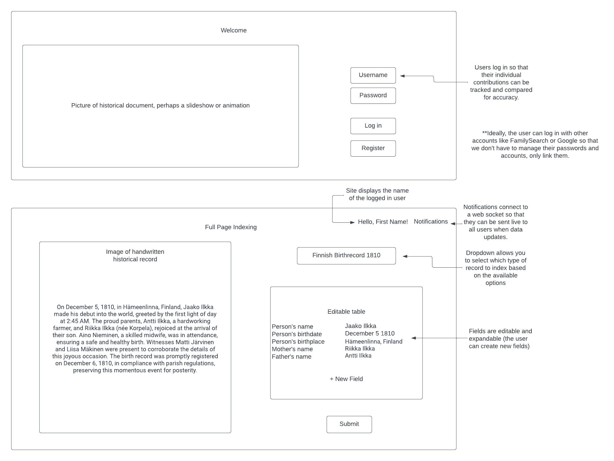

<!-- This should include an elevator pitch, key features, a description of how you will use each technology, and design images. -->

# Elevator Pitch

Indexing is a delicate process that requires a lot of man-hours from trained participants.  We are building a system that will automate the process of indexing textual, handwritten docments in foreign languages. Our website will provide human-in-the-loop correction for this process to improve its performance and iterate our training data. Users will be shown a historical record with pre-indexed fields and asked to correct the fields. This data pipeline will be supported by cutting-edge research in [end-to-end image-to-text models](https://link.springer.com/chapter/10.1007/978-3-031-41731-3_5).

# Website Sketch

# Key Features

- User authentication with HTTPS, and new users can create an account (or potentially use their FamilySearch.org account)
- Ability to choose what type of record to index
- Display of an image of the historical record
- Display of the AI-predicted fields from the image
- Ability to correct the predicted fields
- Ability to add new fields
- User feedback is stored persistently
- User contribution stats and notifications are updated in realtime from the server

# Description of how you will use each technology

- HTML - Uses correct HTML structure for application, with two HTML pages. One landing/login page, and the main page where the indexing will take place.
- CSS - The webpage will be styled with good placement and color scheme. It will also adapt to various screen sizes.
- TypeScript - We will use Typed JavaScript to support login, dynamic display of images and fields, API calls, and database connection.
- Service - Backend service with endpoints for:
  - Login authentication
  - Data collection API
  - Pulling user contribution stats
  - Notifications
- DB - We will store historical records, their index status, and user information.
- Login - We will support user registration and login, with their credentials stored in the database. We will potentially allow authentication through FamilySearch.
- WebSocket - Server notifications sent from us to users, and live updates of user contribution stats.
- React - The frontend will be developed in React

<!-- Your application needs to demonstrate the use of HTML, CSS, JavaScript, calling web services, providing web services, authentication, storing data persistently, and using web sockets for sending realtime data to and from your server. -->
<!-- Authentication: An input for your user to create an account and login. You will want to display the user's name after they login.
Database data: A rendering of application data that is stored in the database. For Simon, this is the high scores of all players.
WebSocket data: A rendering of data that is received from your server. This may be realtime data sent from other users (e.g. chat or scoring data), or realtime data that your service is generating (e.g. stock prices or latest high scores). For Simon, this represents every time another user creates or ends a game. -->
